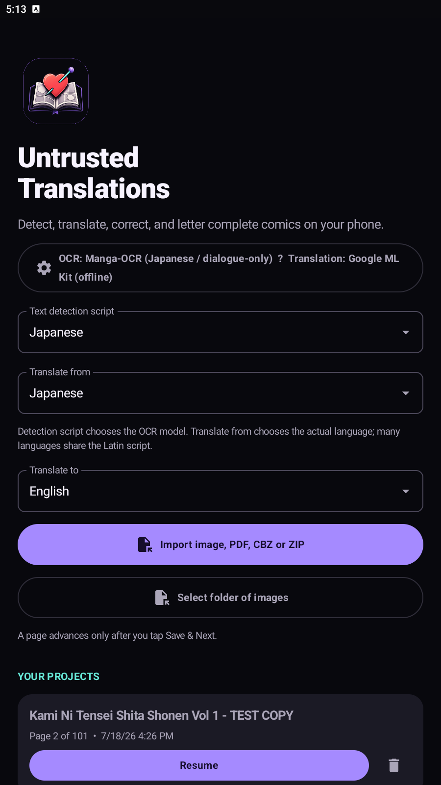
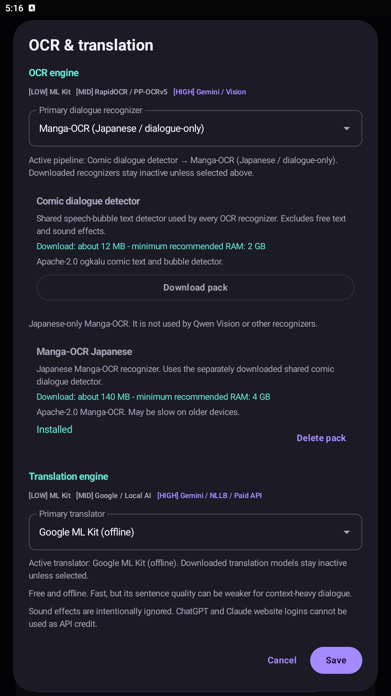
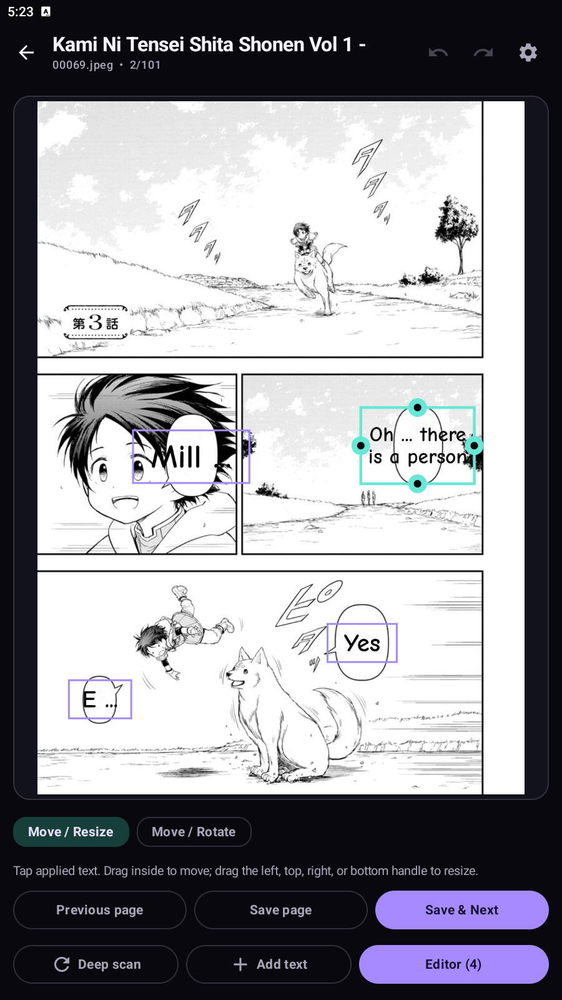
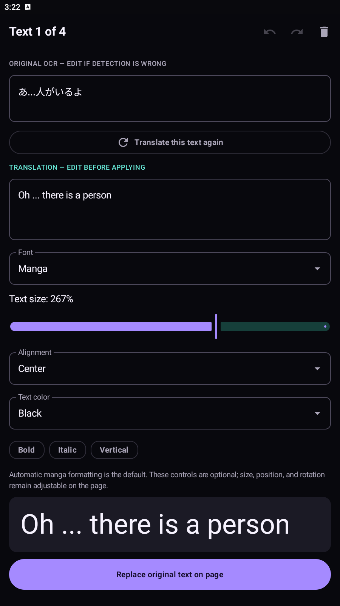
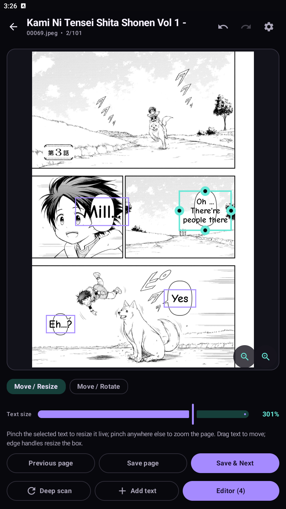
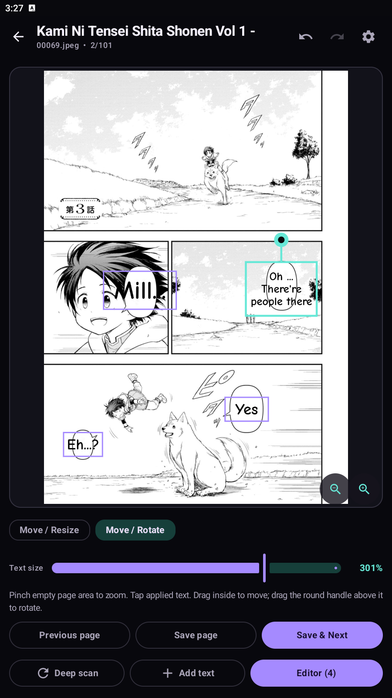

# Untrusted Translations

**Translate and re-letter manga, manhwa, manhua, and comics right on your Android phone.**

I built this out of a simple frustration: translating a chapter on a phone meant juggling an OCR app, a translator, an image editor, and a file manager, and losing my place in all four. Untrusted Translations keeps the whole job in one project. Import a volume, go through the dialogue page by page, fix the translation where it needs fixing, and put the finished text back on the artwork.

Fair warning — the automatic passes aren't magic. OCR will miss weird lettering, translations will sometimes sound off, and cleanup can't understand every speech bubble. That's exactly why the editor exists: the human pass is the point.

[Download the latest release](https://github.com/UntrustedGuy/Untrusted-Translations-Android/releases) · [Report a bug](https://github.com/UntrustedGuy/Untrusted-Translations-Android/issues)

> Please only translate work you have permission to use, and look over a page before you publish it.

## A look at the app

| Import and projects | OCR and translation setup |
| --- | --- |
|  |  |

| Page editor | Translation editor |
| --- | --- |
|  |  |

| Placing translated text: Move / Resize | Move / Rotate |
| --- | --- |
|  |  |

## What it can do

- Import PNG, JPEG, WebP, PDF, CBZ, ZIP, or a whole folder of images.
- Keep archive pages in natural order, so page 2 actually comes before page 10.
- Detect dialogue while deliberately skipping likely sound effects and decorative text.
- Let you fix both the recognized source text and its translation.
- Replace dialogue on the page, then tap a block to move, resize, or rotate it.
- Pinch to zoom into a page (or use the zoom buttons) for precise placement, and bump the text size up or down with the A− / A+ buttons or the editor slider.
- Add your own text with the bundled manga font and an optional background.
- Change font, size, alignment, colour, bold, italic, and vertical-text settings when you need to.
- Save the current page, go back to an earlier one, or hit **Save & Next** when you're actually done with it.
- Recover editable projects from private app storage and export a separate translated copy.

Your original import is never edited in place. Images export as PNG, PDF as PDF, CBZ as CBZ, and ZIP/folder projects as ZIP under `Downloads/Untrusted Translations`.

## Install

The current release is **1.0.0**. Most physical Android phones want the **ARM64** APK; the x86_64 build is mainly for emulators.

Two editions are published per release:

- **Full** — everything, including Google ML Kit for quick baseline OCR and translation.
- **FOSS** — the same app without the closed-source ML Kit SDK, using the local open-source engines instead. This is the build intended for F-Droid.

If you're coming from a 0.x beta, uninstall it once before installing 1.0.0 — the release is now signed with a permanent key, and Android refuses to update across a key change. From 1.0.0 onward, updates install normally over the top and keep your projects, settings, and downloaded models.

The models aren't hidden inside the APK. Optional OCR and translation packs are downloaded from their credited upstream projects only when you pick them.

At launch the app checks a small manifest in this repository for a newer release, a replacement Gemini model name, and corrected model download links. Any remotely changed model file has to come from an approved HTTPS host and carry its expected SHA-256 hash. When a newer APK exists you'll get an update prompt — and Android still asks before installing anything.

## A normal translation session

1. Pick the text-detection script, source language, and target language.
2. Open **OCR & translation** and choose one dialogue recognizer and one translator.
3. Download any optional model you want, then tap **Use model**. Downloading a model doesn't activate it by itself.
4. Import a page, archive, PDF, or folder.
5. Check the detected dialogue. Try **Deep scan** if a real speech bubble was missed.
6. Open the editor, repair the OCR text and translation, then apply it.
7. Tap the replacement on the page to position, resize, or rotate it. Zoom in if the bubble is small.
8. Save the page, go back, or choose **Save & Next**. On the final page, use **Save & Exit**.

There's no automatic page advance. A long archive only moves forward when you save and tell it to.

## Detection script vs. source language

These are separate settings because OCR and translation need different information.

- **Text detection script** chooses the alphabet/model family: Japanese, Korean, Chinese, or Latin.
- **Translate from** identifies the actual language being translated.

So a French comic should use **Latin** for detection and **French** as the source language. A Japanese manga normally uses Japanese for both.

## OCR choices

Every recognizer is paired with the shared comic-dialogue detector. That first stage finds bubble text and rejects likely free text/SFX; the OCR you selected then reads the accepted crops. **Deep scan** relaxes the detector, but it still tries to avoid sound effects.

- **Baberu OCR** — a compact multilingual manga-bubble recognizer for Japanese, Chinese, and English.
- **Manga-OCR** — a Japanese specialist that handles vertical text, furigana, and manga lettering.
- **RapidOCR / PP-OCRv5** — small script-specific PaddleOCR-derived ONNX packs.
- **Qwen2-VL Vision High** — a much larger local vision model for difficult pages.
- **Google ML Kit** — the quick baseline for clean printed text.
- **Gemini** — optional online page OCR using your own API key and quota.

One recognizer is active at a time. Installing three models doesn't make the app silently combine all three.

## Translation choices

- **Local Qwen3** — fully on-device contextual translation in Low (about 485 MB), Mid (about 1.28 GB), and High (about 2.50 GB) sizes.
- **Google ML Kit** — lightweight offline translation once its language pack is available.
- **NLLB-200 (legacy)** — about 950 MB and ARM64 only. It's a general-domain research model, not manga-tuned, and its short-dialogue translations can be rough. The model is **CC BY-NC 4.0 and non-commercial**.
- **Gemini** — official API access using your own key/free quota.
- **Google Translate (unofficial)** — experimental no-key endpoint that may get rate-limited or disappear.
- **OpenAI, Claude, or a custom OpenAI-compatible endpoint** — bring-your-own-key services. Provider billing and terms apply.

A ChatGPT or Claude website subscription can't be reused as API credit. The app never ships a shared developer key and never switches you to a paid service without your configuration.

## Local model sizes

| Pack | Approximate download | Suggested RAM |
| --- | ---: | ---: |
| Comic dialogue detector | 12 MB | 2 GB+ |
| Baberu OCR | 121 MB | 3 GB+ |
| Manga-OCR | 140 MB | 4 GB+ |
| Qwen3 translation Low | 485 MB | 3 GB+ |
| NLLB translation (legacy) | 950 MB | 6 GB+ |
| Qwen3 translation Mid | 1.28 GB | 5 GB+ |
| Qwen2-VL Vision High | 1.70 GB | 6 GB+ |
| Qwen3 translation High | 2.50 GB | 7 GB+ |

Those figures are download sizes, not guarantees. Page resolution, Android memory pressure, and your phone's CPU all affect speed and whether a large model runs comfortably. Downloads resume where the host supports it, and pinned large files are checked against their expected SHA-256 hashes before activation.

## Privacy

Local providers keep OCR and translation on the device. Online providers receive the image or text needed for the request you made and operate under their own privacy policies.

API keys are encrypted with AES-GCM using a non-exportable Android Keystore key, and you can remove them from settings any time. Originals and working project files stay in app-controlled storage; only an exported copy is written to Downloads.

## Known limitations

- OCR isn't perfect, especially with handwriting, very stylized fonts, low-resolution scans, or unusual bubble shapes.
- Dialogue filtering can reject a real line or let an SFX through. Deep scan helps with misses but is intentionally not a "detect everything" mode.
- Automatic text removal and lettering won't match every original font or painted background.
- Large local models take a while to load and may be impractical on lower-memory phones.
- CBR/RAR import isn't supported yet.
- Keep backups of anything you'd hate to lose — it's still a young app.

## Building from source

You need JDK 17, Android SDK 36, Android NDK `27.3.13750724`, CMake `3.31.6`, Ninja, and Git with submodule support.

```bash
git clone --recurse-submodules https://github.com/UntrustedGuy/Untrusted-Translations-Android.git
cd Untrusted-Translations-Android
./gradlew :app:assembleDebug
```

On Windows, use `.\gradlew.bat :app:assembleDebug`. If you cloned without submodules, run `git submodule update --init --recursive` first. The first build is slow because llama.cpp gets compiled for ARM64 and x86_64.

## Thanks and credits

Untrusted Translations is written and maintained by me, [UntrustedGuy](https://github.com/UntrustedGuy). That said, it wouldn't exist in its current form without a lot of open work from other people, most of it shared under the Apache License 2.0 — which asks exactly one thing in return: credit. So, credit where it's due:

- [ImageTrans](https://www.basiccat.org/imagetrans/) and [BallonsTranslator](https://github.com/dmMaze/BallonsTranslator) showed what a good computer-assisted comic translation workflow could look like. This project is an original Android implementation, not a port of either codebase.
- [ogkalu](https://huggingface.co/ogkalu/comic-text-and-bubble-detector) published the RT-DETR-v2 comic text/bubble detector used to separate dialogue from free text (Apache-2.0).
- [kha-white](https://github.com/kha-white/manga-ocr) created Manga-OCR (Apache-2.0); [jzhang533](https://huggingface.co/jzhang533/manga-ocr-base-2025) produced the 2025 fine-tune; and [l0wgear](https://huggingface.co/l0wgear/manga-ocr-2025-onnx) exported the ONNX files used here.
- [genshiai-daichi](https://huggingface.co/genshiai-daichi/baberu-ocr) created Baberu OCR (Apache-2.0) and credits DINOv2, Manga-OCR, and PaddleOCR-VL as its upstream components/teachers.
- The [RapidAI team](https://github.com/RapidAI/RapidOCR) and [PaddleOCR contributors](https://github.com/PaddlePaddle/PaddleOCR) (both Apache-2.0), plus [monkt](https://huggingface.co/monkt/paddleocr-onnx)'s ONNX conversions, are behind the RapidOCR options.
- [niedev](https://github.com/niedev/RTranslator) published RTranslator's Android-optimized NLLB files (RTranslator code is Apache-2.0). The underlying NLLB-200 model is from Meta's NLLB team and remains non-commercial.
- The [Qwen team](https://huggingface.co/Qwen) at Alibaba Cloud created Qwen3 and Qwen2-VL (Apache-2.0); [bartowski](https://huggingface.co/bartowski) published the Qwen3 GGUF quantizations; and [ggml-org](https://huggingface.co/ggml-org/Qwen2-VL-2B-Instruct-GGUF) published the Qwen2-VL GGUF model/projector.
- [llama.cpp](https://github.com/ggml-org/llama.cpp) (MIT) provides local GGUF inference, [ONNX Runtime](https://github.com/microsoft/onnxruntime) (MIT) runs the ONNX models, and Android/Kotlin/Jetpack Compose (Apache-2.0)/Google ML Kit provide the platform and lightweight mobile ML pieces.
- [Comic Neue](https://github.com/crozynski/comicneue), by the Comic Neue project authors, is the bundled lettering font under the SIL Open Font License 1.1.

For exact licenses, copyright holders, model restrictions, upstream links, and service terms, read [THIRD_PARTY_NOTICES.md](THIRD_PARTY_NOTICES.md). Bundled texts include the [llama.cpp MIT license](third_party/llama.cpp/LICENSE), [Comic Neue OFL-1.1](app/src/main/assets/fonts/OFL-ComicNeue.txt), and the full [Apache License 2.0](RTRANSLATOR_LICENSE.txt).

## License

The application source is available under [GNU GPL-3.0](LICENSE). Downloaded models, bundled libraries, fonts, and online services keep their own licenses and terms. The GPL does not remove NLLB's non-commercial restriction or grant rights to the comics you translate.
